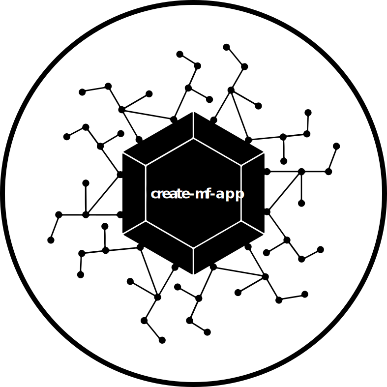

<p align="center">
  <a href="https://github.com/jherr/create-mf-app">
    
  </a>
</p>
<h1 align="center">
create-mf-app
</h1>
<p align="center">
  <a href="https://badge.fury.io/js/create-mf-app">
    </img>
  </a>
  <a href="https://badge.fury.io/js/create-mf-app">
    </img>
  </a>
</p>
<p align="center">
<b>create-mf-app</b> is a tool to create a <b>Module Federation application</b>, <b>API server</b>, or <b>library</b> based on one of multiple different templates.
</p>

<!-- # create-mf-app
[](https://badge.fury.io/js/create-mf-app) [](https://badge.fury.io/js/create-mf-app)

Creates a Module Federation application, API server, or library based on one of multiple different templates. -->


## Usage
```
npx create-mf-app
```

These projects are not production complete. They are designed as lightweight projects that can be used to quickly prototype a new feature or library.

## Programmatic Usage

```js
const builder = require("create-mf-app");

builder({
  type: "Application",
  name: "my-project",
  port: "8080",
  framework: "react",
  language: "typescript",
  css: "Tailwind"
});
```
